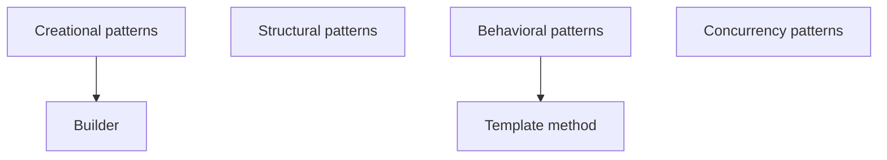

# design-patterns

# Node links

[Template method](https://github.com/LastovkinKirill/design-patterns/tree/main/template_method)

# Plan

1. Patterns to write
    1. Creational:
        1. Builder
        2. Abstract Factory
        3. Factory method
        4. Singleton
        5. Prototype
    2. Structural
        1. Adapter
        2. Bridge
        3. Facade
        4. Decorator
        5. Proxy
        6. MVC
            1. Design pattern or architectural pattern ?
        7. Composite
            1. ?
        8. Flyweight
            1. ?
    3. Behavioral
        1. Template method
        2. Strategy
        3. Observer
        4. Visitor
        5. Chain of responsibility
        6. Iterator
        7. Mediator
        8. State
        9. Command
        10. Interpreter
            1. ?
        11. Memento
            1. ?

# Questions

1. What is anti-patterns?

# Requirements for the cheat sheet

1. Скорость.
    1. Она должна быть быстро написана, без перфекционизма и лишних подробностей и углублений.
2. Практика.
    1. Обязательно практически написанный тобой код. Но только необходимый, чтобы прощупать предмет изучения. Без лишних
       примеров.
3. Понять предмет изучения.
4. Вся структура шпаргалки строиться на вопросах.
5. Шпаргалка должна быть короткой.
6. Ссылки на ресурсы и источники, которые тебе помогали понять и ты использовал при написании шпаргалки.
7. Шпаргалка нужно, чтобы все усвоить, запомнить и быстро вспомнить.
