# Design patterns

В паттернах основной подход к изучению. Определить задачу с проблемой. Привести пример плохого решение и правильного
решения с паттерном.

паатерны нужны чтобы решать пробелмы а не задачи. задачи можно решить по разнмоу но можно нагадить так чтобы потом с этим мучиться при поддержке и расшиернии. те вы нарушили солид.
поэтому паттерны нужны чтобы решать задачи по принципу солид.

# Plan

```mermaid
graph TD
;
    principles[Principles]
    principles --> KIS[KIS];
    principles --> DRY[DRY];
    principles --> SOLID[SOLID];
    principles --> smelly_code[Smelly code];
%%%%    
    design_patterns[Design patterns];
    design_patterns --> creational[Creational patterns];
    design_patterns --> structural[Structural patterns];
    design_patterns --> behavioral[Behavioral patterns];
    design_patterns --> concurrency[Concurrency patterns];
%%%%
    creational --> builder[Builder];
    creational --> abstract_factory[Abstract Factory]
    creational --> factory_method[Factory method]
    creational --> singleton[Singleton]
    creational --> prototype[Prototype]
%%%%
    structural --> adapter[Adapter]
    structural --> bridge[Bridge]
    structural --> facade[Facade]
    structural --> decorator[Decorator]
    structural --> proxy[Proxy]
    structural --> composite[Composite]
    structural --> flyweight[Flyweight]
%%%%    
    behavioral --> template_method[Template method]
    behavioral --> strategy[Strategy]
    behavioral --> observer[Observer]
    behavioral --> visitor[Visitor]
    behavioral --> chain_of_responsibility[Chain of responsibility]
    behavioral --> iterator[Iterator]
    behavioral --> mediator[Mediator]
    behavioral --> state[State]
    behavioral --> command[Command]
    behavioral --> interpreter[Interpreter]
    behavioral --> memento[Memento]
%%%%
    architectural_patterns[Architectural patterns]
    architectural_patterns --> mvc[MVC];
    architectural_patterns --> layered_architecture[Layered Architecture];
    architectural_patterns --> ports_and_adapters[Ports and Adapters 'Hexagonal' architecture];
    architectural_patterns --> onion_architecture[Onion architecture];
    architectural_patterns --> clean_architecture[Clean architecture];
    architectural_patterns --> microservice_architecture[Microservice architecture];
%%%%    
    other_patterns[Other patterns and principles];
    other_patterns --> dto[DTO];
    other_patterns --> microservices_and_monolith[Microservices and monolith];
    other_patterns --> dependency_inversion_principle[Dependency inversion principle];
    other_patterns --> monkey_patch[Monkey patch];
    other_patterns --> tdd_fdd_ddd_bdd[TDD FDD BDD DDD];
    other_patterns --> active_record_architecture[Active record];
    other_patterns --> distributed_architecture[Distributed architecture];
    architectural_patterns[Architectural patterns]
    other_patterns --> dao[DAO];
    other_patterns --> Repository[Repository];

```

# Node links

* [Template method](https://github.com/LastovkinKirill/design-patterns/tree/main/template_method)
* [Iterator](https://github.com/LastovkinKirill/design-patterns/tree/main/iterator_pattern)

# Priority

1. Design Patterns
    1. Creational:
        1. Builder
        2. Abstract Factory
        3. Factory method
        4. Singleton
        5. Prototype
    2. Structural
        1. Adapter
        2. Bridge
        3. Facade
        4. Decorator
        5. Proxy
        6. MVC
            1. Design pattern or architectural pattern ?
        7. Composite
            1. ?
        8. Flyweight
            1. ?
    3. Behavioral
        1. Template method
        2. Strategy
        3. Observer
        4. Visitor
        5. Chain of responsibility
        6. Iterator
        7. Mediator
        8. State
        9. Command
        10. Interpreter
            1. ?
        11. Memento
            1. ?

# Questions

1. What for patterns?
   2. паттерны это как решать задачи с точки зрения стиля. Можно решить задачу по разному, но они будут проблемы потом
   3. какую задачу решали паттерны
      4. они говорят как писать код по солид когда ты встречаешься целевую задачу.
2. What is anti-patterns?
2. Dependency injection is a pattern or not? and what it is?

# Requirements for the cheat sheet

1. Скорость.
    1. Она должна быть быстро написана, без перфекционизма и лишних подробностей и углублений.
2. Практика.
    1. Обязательно практически написанный тобой код. Но только необходимый, чтобы прощупать предмет изучения. Без лишних
       примеров.
3. Понять предмет изучения.
4. Вся структура шпаргалки строиться на вопросах.
5. Шпаргалка должна быть короткой.
6. Ссылки на ресурсы и источники, которые тебе помогали понять и ты использовал при написании шпаргалки.
7. Шпаргалка нужно, чтобы все усвоить, запомнить и быстро вспомнить.

Design patterns in programming exist to provide reusable solutions to common design problems encountered during software
development. They offer established best practices, guidelines, and templates for structuring code and solving recurring
design challenges efficiently. Here are some key reasons why design patterns are used and the problems they solve:

1. Problem Abstraction: Design patterns help abstract away from low-level implementation details and focus on
   higher-level design concepts and structures. They provide a common language for developers to communicate and
   understand design solutions.

2. Code Reusability: Design patterns encapsulate proven solutions to recurring design problems, making them reusable
   across different projects and contexts. This promotes code reusability and reduces duplication, leading to more
   maintainable and scalable codebases.

3. Scalability and Flexibility: By following design patterns, developers can create software architectures that are
   flexible and scalable. Patterns like Factory, Builder, and Strategy enable the creation of modular, loosely coupled
   components that can be easily extended or modified without affecting other parts of the system.

4. Maintainability and Readability: Design patterns promote clean, understandable code by organizing software components
   in a structured and consistent manner. They improve code maintainability by providing well-defined solutions to
   common problems, making it easier for developers to understand and modify existing code.

5. Solving Specific Problems: Design patterns address specific problems or challenges encountered during software
   development, such as object creation, behavior encapsulation, algorithm design, concurrency management, and more. For
   example, Singleton ensures that a class has only one instance, Observer facilitates communication between objects,
   and Adapter enables interoperability between incompatible interfaces.

6. Best Practices and Guidelines: Design patterns embody best practices and guidelines accumulated over years of
   software engineering experience. They reflect industry-wide consensus on effective software design principles and
   help developers avoid common pitfalls and anti-patterns.

7. Facilitating Communication and Collaboration: Design patterns serve as a common vocabulary for discussing and
   documenting software designs. They facilitate communication and collaboration among team members by providing a
   shared understanding of design concepts and solutions.

In summary, design patterns in programming serve as proven solutions to common design problems, promoting code
reusability, scalability, maintainability, and flexibility. They enable developers to create well-structured,
understandable, and maintainable software architectures while adhering to established best practices and guidelines.

